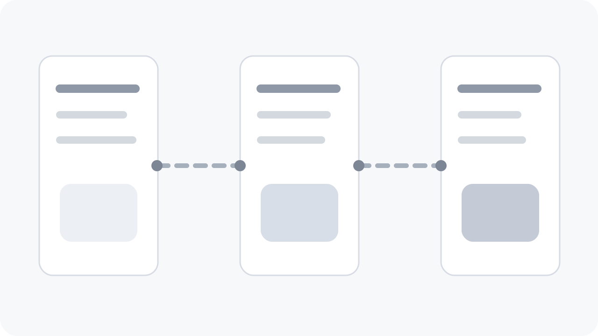

## 项目背景

这个项目面对的是一个典型的“信息太多、判断太慢”的后台场景。质检团队同时盯着多个工厂、批次和异常类型，原有系统把表格、告警、文档拆散到了多个页面，导致切换成本很高。

目标不是再做一个花哨的大屏，而是做一个真正适合长时间盯盘的控制台：低刺激、可追踪、重点明确。

## 关键决策

### 信息密度控制

我把最关键的三类信息压缩成同屏结构：

1. 批次健康度
2. 异常流入速度
3. 处置链路当前阻塞点

二级信息统一进入右侧抽屉和详情面板，避免用户在主视图里同时处理太多视觉竞争。

### 交互与状态分层

筛选、排序、展开和跳转都保留清晰的层级，不让页面在一个视图里承担“编辑器 + 仪表盘 + 日志台”三种角色。

```ts
type InspectionBatch = {
  id: string;
  region: string;
  alertLevel: 'low' | 'medium' | 'high';
  defectRate: number;
  blockedBy?: string;
};

const nextPriority = (batches: InspectionBatch[]) =>
  batches
    .filter((item) => item.alertLevel !== 'low')
    .sort((left, right) => right.defectRate - left.defectRate)[0];
```

## 视觉节奏

正文和数据卡之间统一采用窄边框、低对比底色与一致圆角，避免“这块很重、那块很轻”的不稳定感。



## 结果

- 新用户首次上手路径从 12 分钟降到 5 分钟以内
- 日常异常排查时的页面切换次数显著下降
- 组件样式被抽离成一套可复用的内部设计语言
