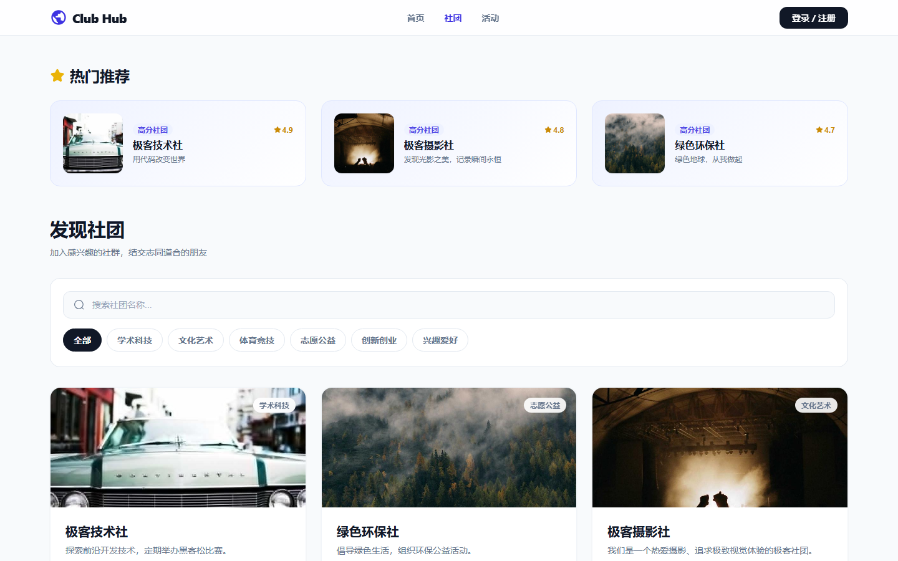
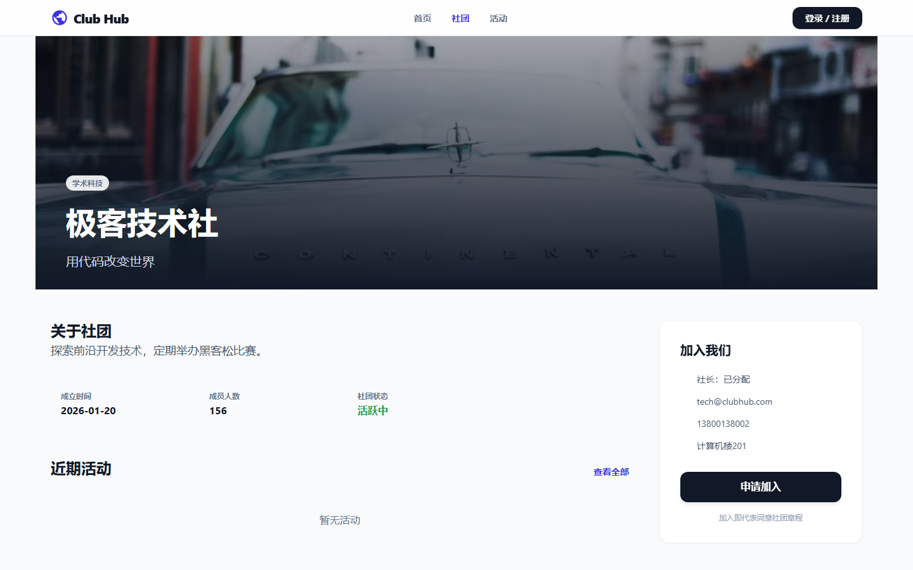
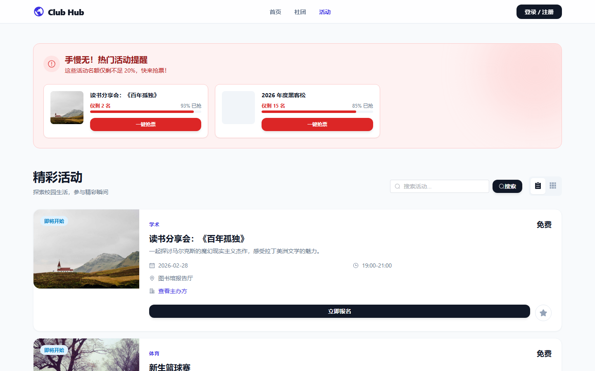
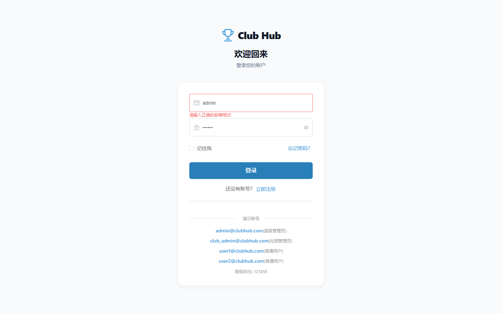
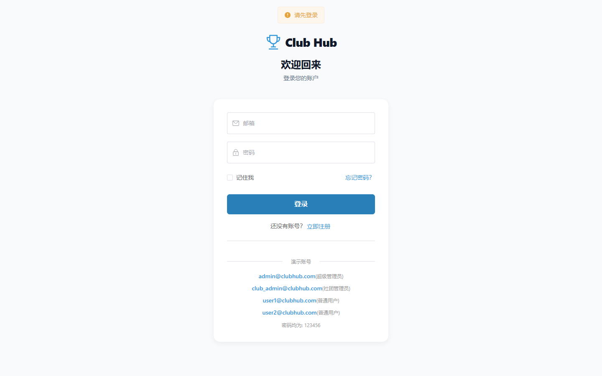

## 项目背景

ClubHub 是一个面向大学校园的社团管理与参与平台。它的核心定位不是简单的社团信息展示，而是把「发现社团」「参与活动」「记录成长」三件事串联成一个闭环：学生可以浏览和搜索各类社团，报名参加感兴趣的活动，同时系统会自动沉淀个人的社团参与历程，形成可分享、可导出的成长档案。

在设计上，我希望这个平台能兼顾信息效率与视觉表达——社团列表页需要有足够的筛选能力帮助学生快速定位兴趣社群，活动页需要降低报名阻力，而管理后台则需要让不同角色的管理员各司其职。

## 我重点处理的问题

### 1. 把「发现社团」做成有推荐逻辑的浏览体验

社团列表页不是静态罗列，而是围绕「如何让学生更快找到合适的社团」做了多层设计：

1. **智能推荐区**：未登录用户看到高分热门社团，已登录用户基于兴趣分类匹配推荐
2. **分类筛选标签**：学术科技、文化艺术、体育竞技等七个维度一键过滤
3. **实时搜索**：支持按社团名称关键词即时检索
4. **卡片信息密度**：每张卡片展示封面图、分类标签、成员数和简介，hover 时有缩放动效

推荐逻辑的意图是降低首次使用时的选择成本——学生不需要翻完所有社团才能找到感兴趣的，顶部推荐区会根据场景给出合理的候选。

### 2. 成长档案：让参与记录变得有仪式感

很多社团管理系统只关注「报名-参加」这个单次动作，但 ClubHub 增加了一个成长档案模块，把学生的社团历程沉淀为可回顾、可分享的内容：

1. **个人信息卡片**：展示头像、昵称、院系和统计概览（加入社团数、参与活动数、累计积分）
2. **我的社团**：以卡片网格展示已加入的社团及成员角色
3. **参与历程时间线**：按时间顺序展示所有报名和参加过的活动
4. **导出证书**：支持将个人档案导出为 PDF 格式的参与证明
5. **分享功能**：生成二维码和分享链接，方便对外展示个人社团经历

这个模块的设计意图是让社团参与从「一次性消费」变成「可积累的履历」，对学生的评奖评优和自我展示都有实际价值。

### 3. 三角色权限与差异化界面

系统围绕 `super_admin`、`club_admin`、`user` 三类角色设计了不同的操作边界：

1. **超级管理员**：拥有仪表盘、社团管理、活动管理、成员管理和用户管理五个模块，可审批社团创建申请、管理所有用户账号
2. **社团管理员**：管理自己负责的社团信息和活动
3. **普通用户**：浏览社团、报名活动、管理个人档案

路由层面通过 `meta.roles` 标识和 `beforeEach` 守卫双重控制页面访问范围，不满足条件的用户会被自动重定向，避免在页面内部到处做权限判断。

### 4. 社团创建与审批流程

学生不仅可以加入现有社团，还可以申请创建新社团。创建申请提交后进入 `pending` 状态，需要超级管理员在后台审批通过后才能正式展示。这个流程保证了社团质量的可控性，同时也降低了学生发起社团的门槛。

## 关键界面

### 社团列表页

这是平台最核心的内容入口。顶部智能推荐区展示三个匹配度最高的社团，下方是完整的社团卡片网格，支持分类筛选和关键词搜索。每张卡片包含封面图、分类徽章、社团名称、简介和成员数。

### 社团详情页

详情页聚合了社团的基本信息、口号、评分、成员列表和关联活动。学生可以在此页面直接报名该社团举办的近期活动，也可以查看其他成员的评价。

### 活动列表页

以卡片列表展示所有即将举办的活动，每张卡片包含活动封面、标题、时间、地点和报名进度。已报满的活动会自动禁用报名按钮。

### 管理后台仪表盘

管理员登录后看到的概览页，展示社团总数、活动数量、成员数量和待审核社团数量等核心指标，快速掌握平台运营状态。

### 用户管理页

超级管理员专属页面，表格展示所有用户信息，支持按角色筛选、编辑用户资料和重置密码。行内操作设计让管理员不需要跳转页面就能完成高频管理动作。

## 技术实现

前端采用 `Vue 3 + TypeScript + Vite + Pinia + Vue Router`，配合 `Element Plus` 提供组件基础，使用 `unplugin-auto-import` 和 `unplugin-vue-components` 实现自动导入。后端采用 `Express + Sequelize + MySQL`，使用 `bcryptjs` 处理密码加密，`jsonwebtoken` 实现认证机制，`multer` 处理文件上传。

### 前端架构与状态管理

使用 Pinia 按业务域拆分 Store（`auth`、`notification` 等），保持数据流清晰。组件层面通过 Props/Events 处理父子通信，跨组件状态统一走 Store。API 层按功能模块拆分（`club.api`、`activity.api`、`portfolio.api` 等），便于维护和扩展。

### 智能推荐的实现

社团列表页的推荐逻辑分两种情况处理：

- 访客模式：按评分降序取前三个社团
- 登录模式：优先推荐与用户已加入社团同分类且未加入的社团，若无匹配则回退到高分推荐

这个逻辑完全在前端计算，避免为推荐功能增加额外的后端接口复杂度。

### 成长档案的证书导出

使用 `jspdf` 和 `jspdf-autotable` 在浏览器端生成 PDF 证书，包含用户基本信息、社团列表和活动参与记录。这种纯前端导出的方式减少了后端压力，同时让生成过程对用户更透明。

### 后端种子数据与自动初始化

后端启动时自动连接 MySQL 数据库、同步模型结构。通过种子脚本预置了五个用户（admin、club_admin、user1-3）、八个社团（五个已激活、三个待审核）、五条活动和完整的报名评价数据，让系统开箱即用。

## 我在这个项目里的关注点

如果把它当作一个作品集案例来看，我最想强调的是三件事：

1. 能把大学社团的完整生命周期（发现-加入-参与-沉淀）放进一个产品里
2. 能通过成长档案模块把「参与活动」转化为「可积累的履历」，提升产品的长期价值
3. 能在一个完整的前后端链路中实现多角色权限、审批流程和前端 PDF 导出等实际功能

这个案例内容不是基于静态稿编写的，而是直接启动了真实的前后端服务、MySQL 数据库和浏览器采集后整理而成。项目页展示的所有界面均来自真实运行状态。
