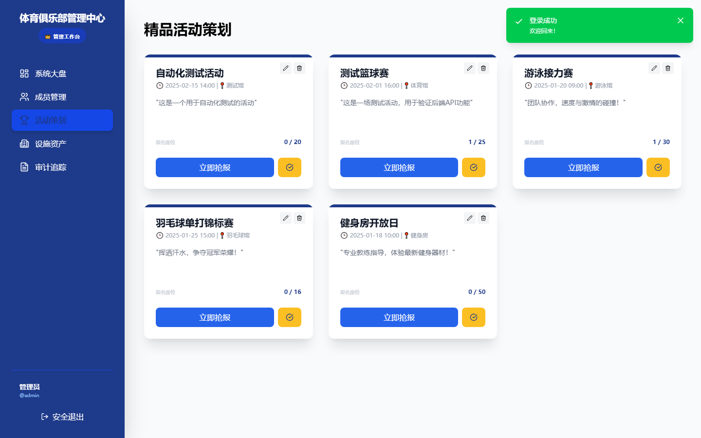
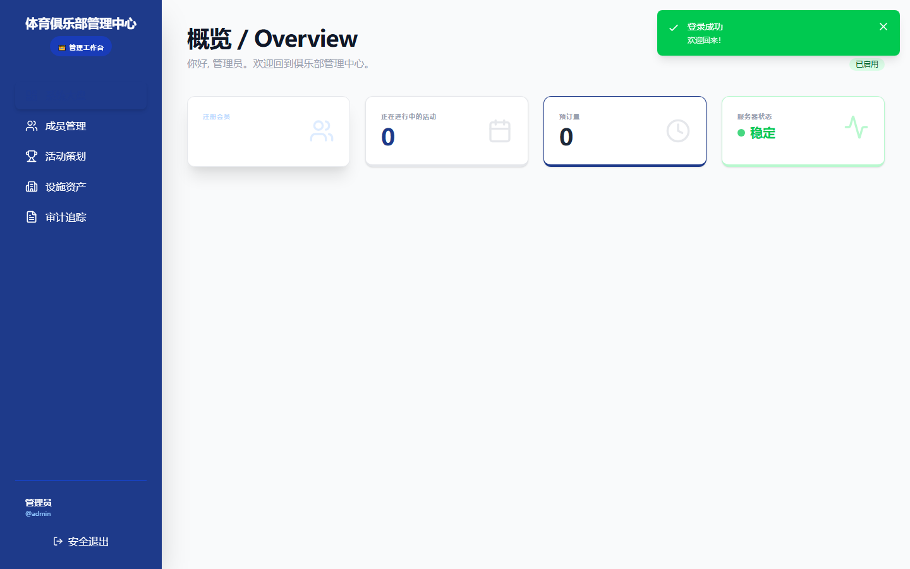
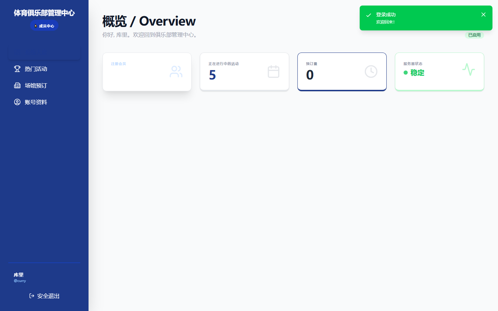
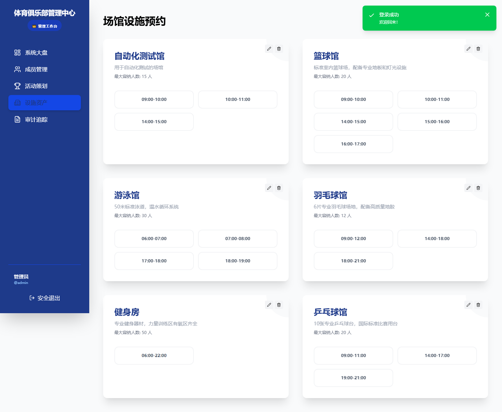
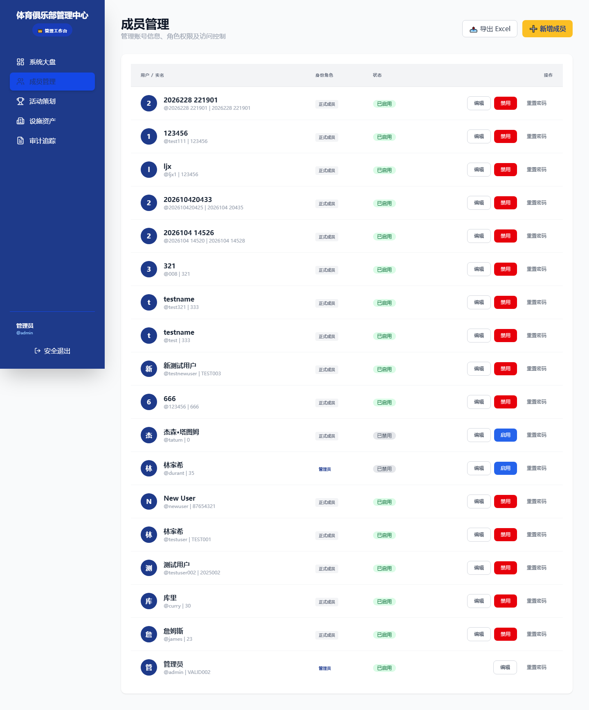

## 项目背景

这个项目面向体育俱乐部的日常管理场景，不是做一个简单的活动列表或场地查询页面，而是试图把活动组织、场馆预约、成员管理和权限控制放进同一套系统里。

在真实使用场景中，一个体育俱乐部通常需要同时处理两类事务：

1. 面向普通成员：浏览活动、报名参与、预约场馆、管理个人资料
2. 面向管理员：发布和管理活动、维护场馆信息、管理成员账号、查看审计日志

我希望这个系统既能满足业务流程的完整性，又能通过视觉风格传递体育场景特有的活力和秩序感，因此整体配色以深蓝和金黄为主，营造专业但不沉闷的界面氛围。

## 我重点处理的问题

### 1. 双角色权限与界面差异

系统围绕 ADMIN 和 STUDENT 两类角色设计了不同的操作边界和侧边栏菜单：

1. 管理员可以看到系统大盘、成员管理、活动策划、设施资产和审计追踪五个核心模块
2. 普通成员只看到系统大盘、热门活动、场馆预订和个人资料四个模块

路由层面通过角色标识和守卫双重控制页面访问范围，管理员专属的成员管理和审计日志两个页面对普通成员完全不可见，避免不同身份看到不必要的界面复杂度。

### 2. 把活动参与做成低阻力的互动流程

活动页面不是静态信息展示，而是围绕报名行为做了几层设计：

1. 每张活动卡片展示标题、描述、时间和报名进度条
2. 已报满的活动自动禁用报名按钮并显示"名额已满"
3. 已报名的活动可随时取消参加
4. 管理员可置顶重要活动、编辑或删除已有活动
5. 每次报名和取消都会记录到审计日志

这样做的好处是把"浏览-判断-决策-执行"这几步全部收敛在同一个卡片上，用户不需要跳转页面就能完成完整的参与流程。

### 3. 场馆预约的时段粒度设计

场馆预约页没有使用传统的日历组件，而是直接把可用时段展示为按钮网格：

1. 每个场馆独立展示名称、描述和容量信息
2. 可用时段以按钮形式排列，已约的时段不可选
3. 用户自己预约的时段以绿色高亮标识，并可一键取消
4. 已满时段显示为灰色禁用状态

这种设计的意图是降低认知负担——用户不需要理解复杂的时段选择器，看到绿色点一下就能预约，看到灰色就知道这个时间段已不可用。

### 4. 把成员管理做成信息密度适中的操作工作台

成员管理页不是一个简单的列表，而是把最常用的管理动作都放在表格行内：

1. 表格展示用户头像（首字母）、用户名、实名、角色和状态
2. 每行支持编辑、启用/禁用状态切换、密码重置
3. 支持新增成员和导出 CSV 到 Excel
4. 超级管理员不可被禁用，保证系统始终有一个维护入口

这个页面的重点不是"好看"，而是让管理员在信息量较大的情况下仍然能快速执行操作。

## 关键界面

### 活动策划页

这是管理员视角最核心的页面。三列卡片网格展示所有活动，每张卡片顶部有进度条指示报名情况，右侧提供编辑和删除操作，底部是报名按钮和置顶控制。黄色的顶部色块标识了这条活动是置顶状态。

### 管理员仪表盘

管理员登录后看到的概览页，四个统计卡片分别展示注册会员数、活动中数量、预订量和服务器状态，下方列出当前置顶的重要活动。

### 学生仪表盘

普通成员登录后看到的视图，同样展示统计概览和置顶活动，但侧边栏没有管理模块，角色标识显示为"成员中心"而非"管理工作台"。

### 场馆预约页

每个场馆以独立卡片展示，可用时段用按钮网格排列，绿色按钮表示已由自己预约，灰色按钮表示已被他人预约，白色按钮可点击预约。

### 成员管理页

管理员专属页面，表格行内集成编辑、启用/禁用和密码重置操作，支持新增成员和 CSV 导出。

## 技术实现

前端采用 `Vue 3 + TypeScript + Vite + Pinia + Vue Router`，后端采用 `Express + Sequelize + MySQL + JWT`。前后端通过 RESTful API 通信。

这个项目的技术实现中有几点值得说明：

### 角色路由与权限守卫

前端路由使用 Vue Router 的 `beforeEach` 守卫，在每次路由跳转前检查用户认证状态和角色权限。管理员专属路由通过 `meta.requiresAdmin` 标识，不满足条件的用户会被自动重定向到仪表盘，避免在页面内部到处做权限判断。

### 后端种子数据与自动初始化

后端启动时自动连接 MySQL 数据库、同步模型结构、插入种子数据。三个预置账号（管理员 + 两名成员）让系统开箱即用，不需要手动初始化。

### 审计日志的行为级记录

每次关键操作（发布活动、报名/取消、场馆预约、成员管理、密码重置等）都会自动记录审计日志，包含操作主体、事件行为和详细说明，为系统合规提供可追溯性。

## 我在这个项目里的关注点

如果把它当作一个作品集案例来看，我最想强调的是三件事：

1. 能把体育俱乐部的日常管理流程拆解为清晰的双角色系统
2. 能在一个相对紧凑的页面结构里，同时兼顾信息密度和操作流畅度
3. 能在一个完整的前后端链路中实现从活动发布到场馆预约的业务闭环

这个案例内容不是基于静态稿编写的，而是直接启动了真实的前后端服务、MySQL 数据库和浏览器采集后整理而成。项目页展示的所有界面均来自真实运行状态。
