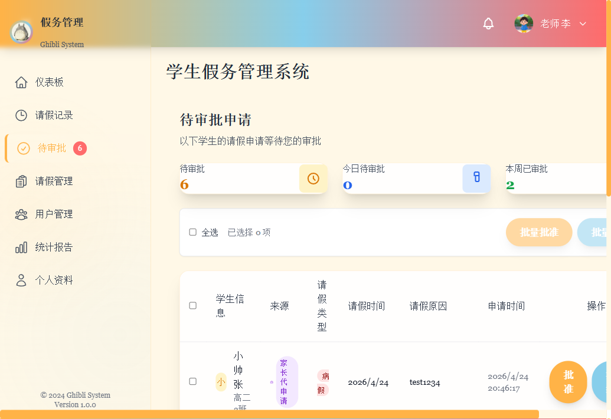
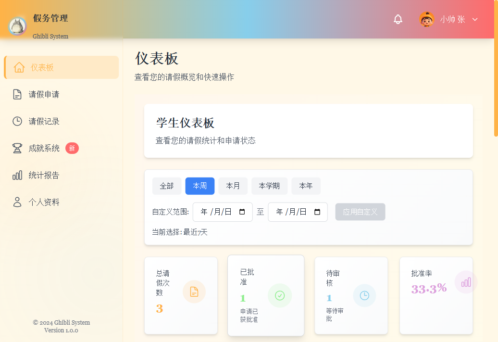
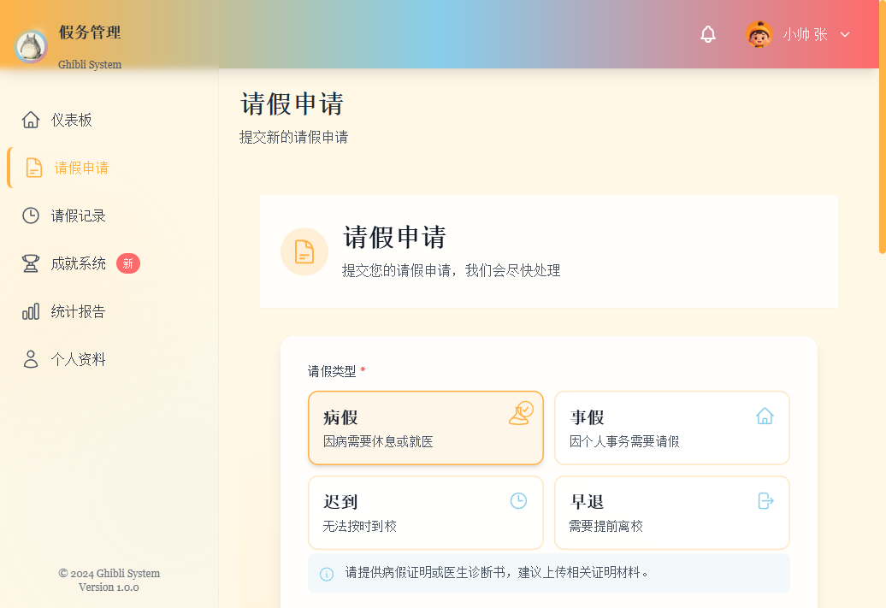
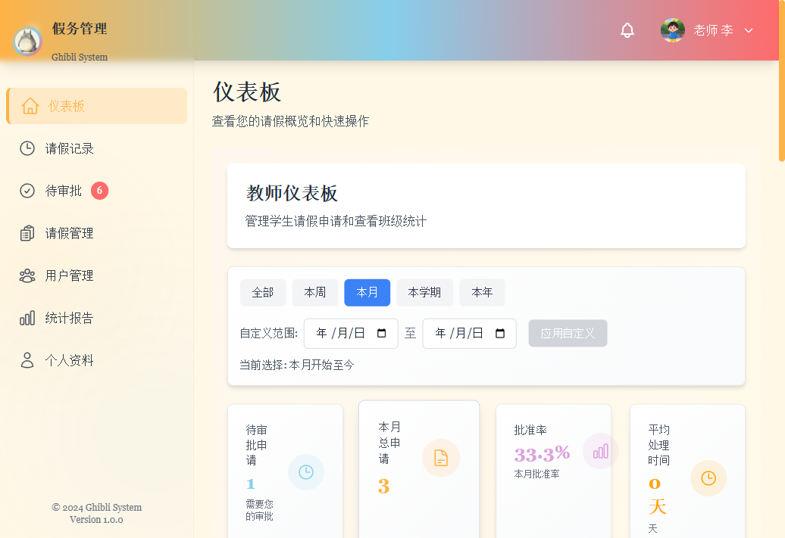
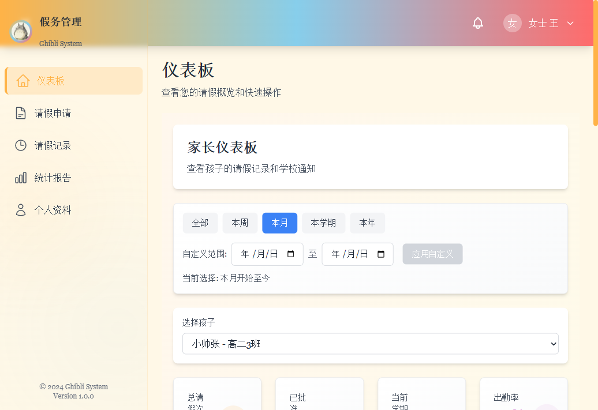

## 项目背景

这个项目面向校园请假场景，不只是做一个“提交表单”的页面，而是试图把学生、教师、家长三方之间的协同关系放进同一套系统里。

在真实使用场景中，请假申请往往会横跨多个角色：

1. 学生发起或查看自己的申请
2. 家长代孩子提交申请并跟进结果
3. 教师集中审批、查看统计并管理记录

我希望这个系统既能把业务流程串起来，又能在界面层面保持轻松、温暖、低压的观感，因此整体视觉风格做成了偏吉卜力气质的校园管理后台。

## 我重点处理的问题

### 1. 把“多角色协同”做成真正可用的体验

这个系统不是单角色 demo，而是围绕三类用户设计了不同的入口和操作边界：

1. 学生侧强调申请、记录、成就与个人统计
2. 教师侧强调待审批队列、批量处理、班级视角和管理能力
3. 家长侧强调孩子选择、代办申请、通知和陪伴式查看

路由层面通过角色和权限双重控制页面访问范围，避免不同身份看到不必要的界面复杂度。

### 2. 让请假流程既完整，又不压迫用户

请假申请页不是简单堆字段，而是拆成了几个更容易理解的输入模块：

1. 请假类型选择
2. 日期与时段选择
3. 原因填写
4. 证明材料上传
5. 家长场景下的子女选择

这样做的目的是把一次相对正式的申请行为，拆成用户更容易逐步完成的输入节奏，降低提交阻力。

### 3. 把审批页做成教师真正愿意长期使用的工作台

教师端的待审批页面不仅展示列表，还把几个高频动作前置出来：

1. 待审批数量
2. 今日待审批
3. 本周已审批
4. 单条批准 / 拒绝 / 查看详情
5. 批量批准 / 批量拒绝

这类页面的重点不是“好看”，而是让老师在信息量较大的情况下仍然能快速判断、快速执行。

## 关键界面

### 学生仪表盘

学生登录后看到的是个人视角的概览页，包含请假次数、批准情况、待审核数量、趋势统计和快速操作入口。这样做可以把“申请”“查看进度”“回顾历史”都收在一个首页内，降低来回跳转成本。

### 请假申请页

申请页是整个流程里最需要细腻交互处理的部分。页面上既要提供清楚的表单结构，也要兼顾错误提示、成功反馈和文件上传这些容易打断节奏的动作。

### 教师仪表盘

教师首页更偏管理视角，会显示待审批数量、本月总申请、批准率、平均处理时间，以及最近申请列表和快捷入口。这个页面的目标是帮助教师在进入具体操作前先建立全局判断。

### 家长仪表盘

家长端和学生端不完全相同。这里加入了孩子选择、学校通知、孩子请假记录概览等内容，让系统不只是“代请假工具”，而是一个更接近家庭协同入口的界面。

## 技术实现

前端采用 `Vue 3 + TypeScript + Vite + Pinia + Vue Router`，后端采用 `Express + Sequelize + MySQL`。

我在这个项目里比较关注两类实现问题：

### 权限与角色边界

前端路由使用角色白名单和权限标识双重控制，保证不同身份在进入页面时就完成第一层过滤，而不是等到页面内部再到处判断。

### 前后端协同与真实数据演示

这次案例内容不是基于静态稿写出来的，而是直接启动了真实前后端服务、本地 MySQL 和测试账号，在浏览器里分别走了学生、教师、家长三类角色流程后整理出的页面素材与文案。因此项目页展示的界面，来自真实运行状态而不是纯视觉稿。

## 我在这个项目里的关注点

如果把它当作一个作品集案例来看，我最想强调的是三件事：

1. 能把一个校园业务流程拆解成可执行的角色系统
2. 能把表单、审批、统计这些复杂后台动作做成更友好的前端体验
3. 能同时兼顾产品流程、界面审美和真实前后端落地

这个项目对我来说，不只是一次页面实现练习，更像是一次把业务闭环、角色协同和界面表达放到同一套系统里打磨的尝试。
