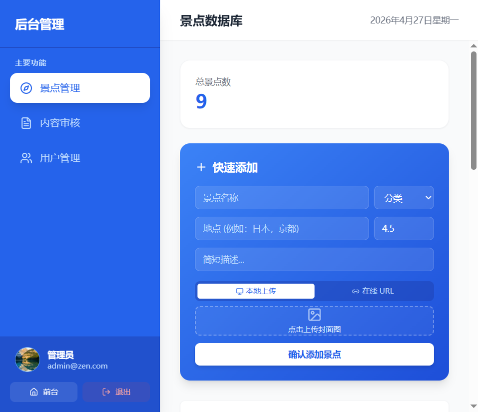
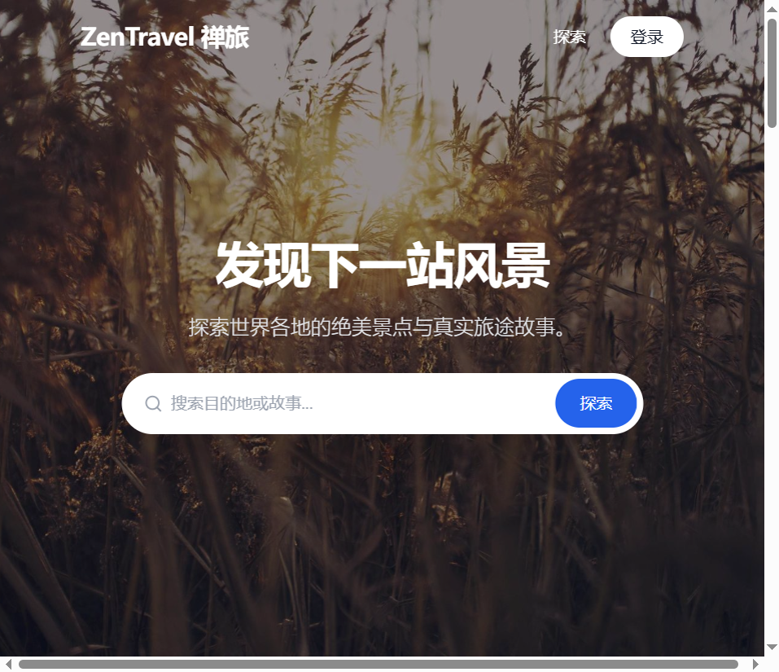
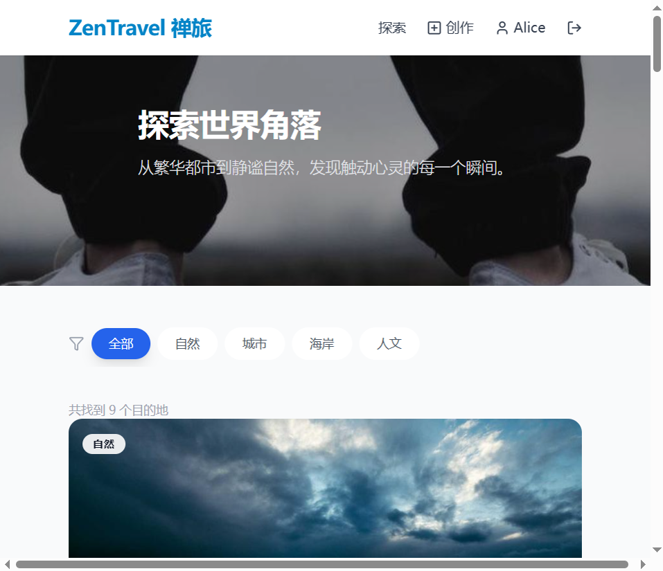
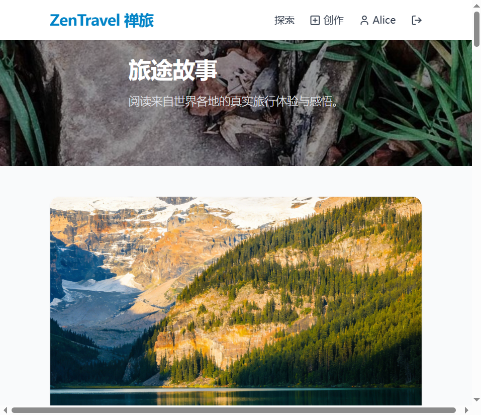
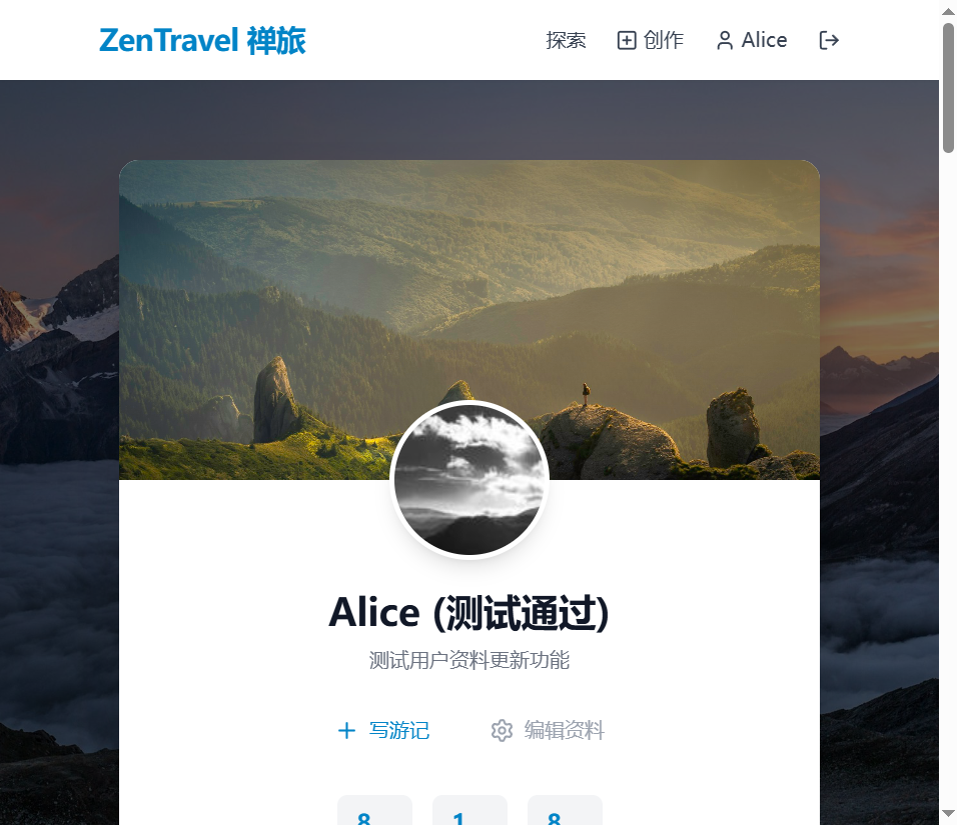

## 项目背景

ZenTravel（禅旅）是一个面向旅行爱好者的内容分享平台。它的核心定位不是简单的旅游信息聚合，而是让「发现风景」和「记录旅途」两件事在同一个产品里形成闭环：用户既可以浏览世界各地的景点，也能阅读他人真实的旅行游记，甚至可以自己创作内容分享给社区。

在设计上，我希望这个平台能传递一种「慢旅行」的气质——不追求信息堆砌，而是通过清晰的视觉层次和流畅的交互，让用户在浏览过程中感受到旅途本身的松弛感。

## 我重点处理的问题

### 1. 把「内容消费」和「内容创作」串成闭环

很多旅游类产品只做其中一端：要么是纯攻略浏览，要么是纯日记工具。ZenTravel 试图把两端连起来：

1. **浏览端**：通过 Hero 搜索、分类筛选、卡片列表降低发现成本
2. **消费端**：景点详情页聚合基本信息、评分、关联游记，让单次浏览更有深度
3. **创作端**：提供游记编辑器，支持封面图上传、富文本内容和 AI 辅助润色
4. **社交端**：收藏、评论、点赞形成轻量互动，让内容有持续被看到的机制

这个闭环的关键在于每个节点的跳转都要自然——从景点卡片到详情页，从详情页到关联游记，从游记到作者主页，这些路径都需要在信息架构层面提前规划。

### 2. 让搜索和筛选真正服务于「发现」

探索页不是简单罗列数据，而是把筛选条件（自然、城市、海岸、人文等分类）放在视觉显著位置，让用户能快速缩小范围。搜索结果同时覆盖景点和游记两类内容，避免用户在不同模块之间反复切换。

### 3. 管理后台不只是「增删改查」

后台管理页面面向运营角色，提供景点数据库管理、用户内容审核和用户账户管理三个核心模块。设计时把高频操作（如快速添加景点、批量审核）前置，减少不必要的页面跳转。

## 关键界面

### 首页

首页以全屏 Hero 区域作为视觉锚点，配合搜索框直接引导用户开始探索。下方分区块展示推荐景点和精选游记，让未登录用户也能快速感知平台的内容质量。

### 探索页

探索页是平台的核心内容入口。顶部保留分类筛选标签，下方以卡片网格展示景点，每张卡片包含封面图、名称、地点、评分和分类标签，信息密度适中，便于快速扫视。

### 游记列表

游记列表页以更大的封面图和更长的摘要展示用户创作的旅行故事，强调内容的叙事性和视觉吸引力。每张卡片的布局考虑了封面图与文字信息的平衡。

### 个人中心

用户个人中心展示了头像、昵称、简介、统计数据（游记数、收藏数等）以及个人创作内容。这个页面既是用户的「数字名片」，也是管理自己内容的入口。

## 技术实现

前端采用 `Vue 3 + TypeScript + Vite + Pinia + Vue Router`，配合 `Tailwind CSS` 完成样式层，使用 `lucide-vue-next` 提供图标系统。后端采用 `Express + Sequelize + MySQL`，使用 `bcryptjs` 处理密码加密，`jsonwebtoken` 实现认证机制，图片上传支持本地存储和七牛云对象存储。

我在这个项目里比较关注两类实现问题：

### 状态管理与组件通信

使用 Pinia 按业务域拆分 Store（spot、travelog、auth、user 等），避免单个 Store 过度膨胀。组件层面通过 Props/Events 处理父子通信，跨组件状态统一走 Store，保持数据流清晰可追踪。

### 前后端协同与真实数据演示

这次案例内容不是基于静态稿写出来的，而是直接启动了真实前后端服务、本地 MySQL 和测试账号，在浏览器里分别走了普通用户和管理员两类角色流程后整理出的页面素材与文案。因此项目页展示的界面，来自真实运行状态而不是纯视觉稿。

## 我在这个项目里的关注点

如果把它当作一个作品集案例来看，我最想强调的是三件事：

1. 能把「内容发现—消费—创作—互动」的完整链路放进一个产品里
2. 能在界面层面兼顾视觉表达和信息效率，不让设计成为使用的负担
3. 能同时兼顾产品流程、界面审美和真实前后端落地

这个项目对我来说，是一次把旅游内容平台的核心体验从 0 到 1 搭建的完整尝试。
